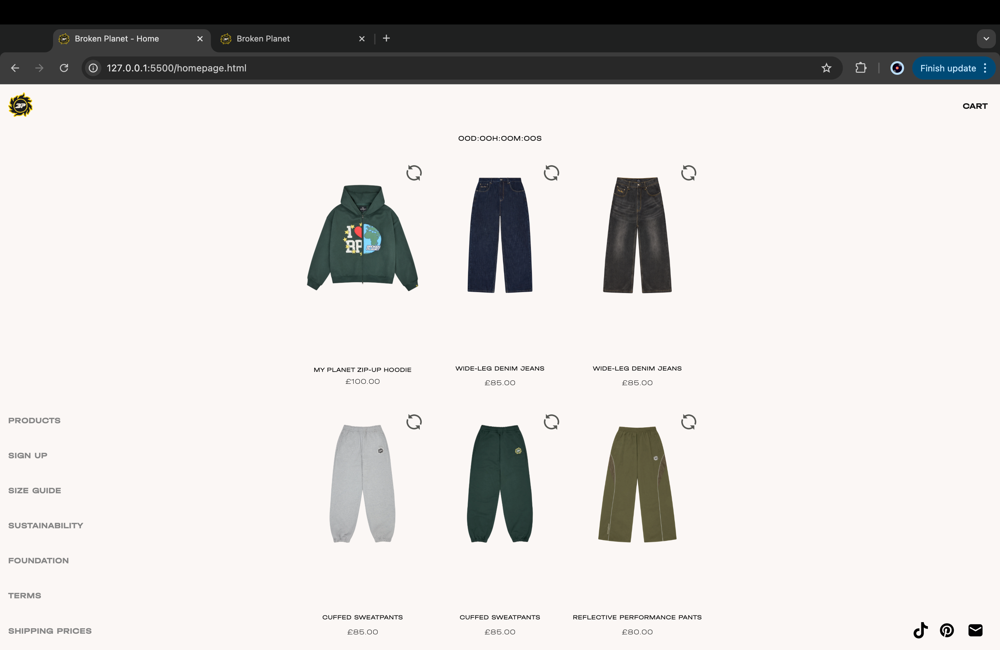

# Procesverslag
Markdown is een simpele manier om HTML te schrijven.  
Markdown cheat cheet: [Hulp bij het schrijven van Markdown](https://github.com/adam-p/markdown-here/wiki/Markdown-Cheatsheet).

Nb. De standaardstructuur en de spartaanse opmaak van de README.md zijn helemaal prima. Het gaat om de inhoud van je procesverslag. Besteedt de tijd voor pracht en praal aan je website.

Nb. Door *open* toe te voegen aan een *details* element kun je deze standaard open zetten. Fijn om dat steeds voor de relevante stuk(ken) te doen.

## Jij

  
uitwerken voor kick-off werkgroep

  ### Auteur:
  Kyra Kuils

  #### Je startniveau:
  Blauw

  #### Je focus:
  Responsive
 

## Je website

  
uitwerken voor kick-off werkgroep

  ### Je opdracht:
  https://www.brokenplanet.com/ 

  #### Screenshot(s) van de eerste pagina (small screen): 
  hier de naam van de pagina  
  

  #### Screenshot(s) van de tweede pagina (small screen):
  hier de naam van de pagina  
  
 

## Toegankelijkheidstest 1/2 (week 1)

  
uitwerken na test in 2e werkgroep

  ### Bevindingen

  - geen samenhang in de teksten. 
  - tekst is alleen maar in capslock. 
  - geen herkening voor invoervelden en buttons.
  - language staat niet in de html (quick fix)
  - op elke pagina staat "broken planet", waardoor je geen idee op welke pagina je bent
  - ze maken geen gebruik van  H- elementen
  - ze maken gebruik van div's en ze gebruiken geen li- elementen
  - ze gebruiken img src maar geen alt tekst

## Breakdownschets (week 1)

  
uitwerken na afloop 3e werkgroep

  ### de hele pagina: 
  
  

  ### dynamisch deel (bijv menu): 
  

  ### wellicht nog een dynamisch deel (bijv filter): 
  

## Voortgang 1 (week 2)

  
uitwerken voor 1e voortgang

  ### Stand van zaken
  hier dit ging goed & dit was lastig (neem ook screenshots op van delen van je website en code)

  ### Agenda voor meeting
  samen met je groepje opstellen
  
| kyra:
| grid of flex gebruiken voor de kleding items?
| hoe moet ik .visually-hidden gebruiken voor mijn H-elementen die ik niet zichtbaar wil hebben?

| pleuni:
| hoe gebruk je :nth-of-type () als je geen classes of divs mag gebruiken?

| yulan:
| hoe krijg ik mijn H1 in het midden?

  ### Verslag van meeting
  hier na afloop snel de uitkomsten van de meeting vastleggen

  - gebruik maken van aria-label als het geen img is.
  - .visually-hidden voor teksten die ik niet zichtbaar wil maken, maar voor de screenreader wel leesbaar is. 
  - voor een font moet ik eerst een font aanmaken door @fontface en daarna spreek je je font aan met font-family:;

## Voortgang 2 (week 3)

  
uitwerken voor 2e voortgang

  ### Stand van zaken
  hier dit ging goed & dit was lastig (neem ook screenshots op van delen van je website en code)

  ### Agenda voor meeting
  samen met je groepje opstellen

| pleuni:
| een vervanging voor class?

| kyra:
| hoe drie css stylesheets aanmaken en waar staat elke stylesheet voor

| yulan:
| h3 onzichtbaar maken

| tamara:
| was later bij de les dus hebben van te voren niet met haar kunnen bespreken

  ### Verslag van meeting
  hier na afloop snel de uitkomsten van de meeting vastleggen

  - 3 css bestanden maken. algemene met je font, root kleur etc. eerste pagina en een voor je tweede pagina
  - place-items:center; (betekent justify & align-items in 1x)

## Toegankelijkheidstest 2/2 (week 4)

  
uitwerken na test in 9e werkgroep

  ### Bevindingen
  Lijst met je bevindingen die in de test naar voren kwamen (geef ook aan wat er verbeterd is):

  
  
  
  
  

## Voortgang 3 (week 4)

  
uitwerken voor 3e voortgang

  ### Stand van zaken
  hier dit ging goed & dit was lastig (neem ook screenshots op van delen van je website en code)

  ### Agenda voor meeting
  samen met je groepje opstellen

| kyra:
| grid-area en @media (min-width en max-width)

| pleuni:
| opstelling van slider en font-size:clamp

| yulan:
| dark/light mode

  ### Verslag van meeting
  hier na afloop snel de uitkomsten van de meeting vastleggen

  - hoe je light/dark toevoegd en hoe je daar een button voor maakt
  - hoe media query gebruiken 
  - waar bijvoorbeeld grid-area: 2/3/3/2 -->  grid-row-start = 2
                                              grid-column-start = 3
                                              grid-row-end = 3
                                              grid-column-end = 2
    

## Eindgesprek (week 5)

  
uitwerken voor eindgesprek

  ### Je uitkomst - karakteristiek screenshots:
  
  
  
  
  

  ### Dit ging goed/Heb ik geleerd: 
  
  Ik weet nu hoe ik een geanimeerde hamburger menu maak door middel van span en translate en dat ging goed. 

  
  
    

  ### Dit was lastig/Is niet gelukt:
  Ik vond het lastig om mijn scherm responsive te maken. Vooral voor de tweede pagina waar ik mijn tekst en buttons aan de rechterkant wilde krijgen als het scherm groter word. Helaas is mij dat niet gelukt. 

  
  

## Bronnenlijst

  
continu bijhouden terwijl je werkt

  Nb. Wees specifiek ('css-tricks' als bron is bijv. niet specifiek genoeg). 
  Nb. ChatGpT en andere AI horen er ook bij.
  Nb. Vermeld de bronnen ook in je code.

  1. [bron 1](https://chatgpt.com/share/675b1283-1fbc-8008-9eea-05be0d409c90)
  2. [bron 2](https://www.w3schools.com/css/tryit.asp?filename=tryresponsive_col-s)
  3. [bron 3](https://www.youtube.com/watch?v=69IbzTWg5PM)
  4. [bron 4](https://codepen.io/shooft/pen/eYwyXLv)
  5. [bron 5](https://codepen.io/shooft/pen/MWMGLGV)
  6. [bron 6](https://www.youtube.com/watch?v=tFKrK4eAiUQ)

